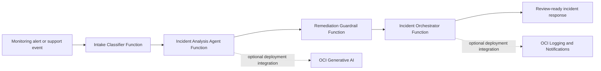

# OCI AI Incident Triage and Remediation Workflow

An original reference implementation for an AI-assisted incident-response workflow on Oracle Cloud Infrastructure (OCI). It receives a sanitized infrastructure alert, classifies its severity and domain, performs contextual analysis, applies deterministic safety controls to proposed remediation, and returns a review-ready incident decision.

This repository is intentionally a **local, non-deployed demonstration**. It contains no OCI credentials, tenancy information, production endpoints, client data, or live-resource access. OCI SDK calls are represented as deploy-time extension points and use resource-principal patterns only.

## Use case

Operations teams receive alerts from many systems and must rapidly decide whether an incident is actionable, which team owns it, what evidence is relevant, and whether a remediation can be safely proposed. This workflow converts a structured alert into a consistent, auditable incident recommendation while ensuring that every destructive or high-risk action requires human approval.

## Architecture



## Four-function flow

1. **Intake classifier** validates the request, redacts basic sensitive patterns, categorizes the alert, and assigns an initial severity.
2. **Incident analysis agent** turns the normalized alert into an evidence plan, probable-cause hypotheses, and safe remediation recommendations. A deployment can use OCI Generative AI here.
3. **Remediation guardrail** applies deterministic policy checks. It blocks destructive recommendations and marks them for human approval.
4. **Incident orchestrator** combines all outputs into a final JSON response suitable for a dashboard, ticketing system, or notification workflow.

## Repository structure

```text
ACE_AI_Agents/
├── functions/
│   ├── intake-classifier/
│   ├── incident-analysis-agent/
│   ├── remediation-guardrail/
│   └── incident-orchestrator/
├── samples/alert.json
├── docs/ARCHITECTURE.md
├── README.md
└── .gitignore
```

## Local demonstration

The functions accept and return JSON through the OCI Functions Python FDK interface. Use `samples/alert.json` as a safe test payload after installing each function's dependencies locally. No deployment is necessary for this repository.

Example normalized alert:

```json
{
  "incident_id": "INC-DEMO-001",
  "service": "sample-api-service",
  "alert_name": "High error rate",
  "summary": "5xx responses exceeded the defined threshold for 10 minutes.",
  "metric_value": 8.2,
  "threshold": 2.0
}
```

## OCI deployment considerations

If deployed later, configure secrets in OCI Vault, grant minimum IAM permissions through dynamic groups, use resource principals, and send only sanitized observability data to an approved Generative AI endpoint. Do not hard-code OCIDs, keys, tokens, URLs, or customer data.

## Author contribution

I designed and implemented the four-stage serverless incident-triage workflow, including input normalization, AI-ready incident analysis, deterministic remediation guardrails, and response orchestration. The project demonstrates a reusable OCI Functions architecture for safe AI-assisted operations workflows.
